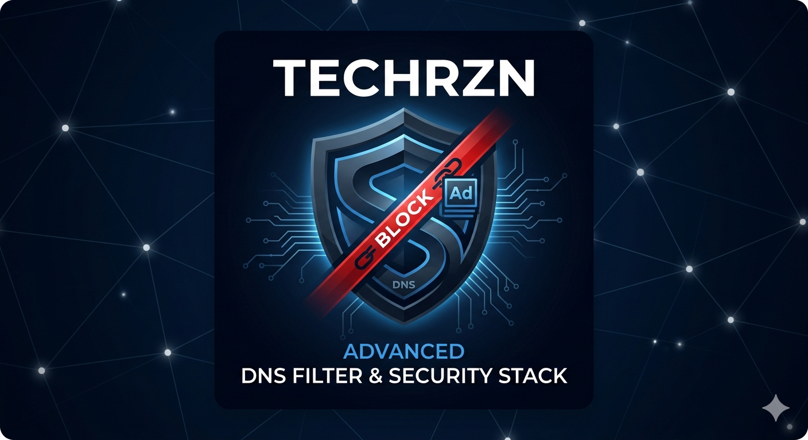

  

# 🛡️ TechRZN DNS Filter Hub
### High-Performance Blocklists • Täglich aktualisiert • 100% Bereinigt

Willkommen beim TechRZN Filter-Hub. Diese "All-in-One" Liste kombiniert die besten Filterquellen der Community, entfernt Duplikate und wendet eine eigene Whitelist an.

---

## 🚀 Die Master-Liste (Empfohlen)
Die ultimative Lösung für AdGuard Home, Pi-hole und Technitium.

**Link für deinen DNS-Filter:**
> `https://raw.githubusercontent.com/SmokingBull/my-blocklist-collection/main/combined_blocklist.txt`

---

## 🧩 Einzelne Module & Urheberrecht
Ein großer Dank geht an die Community-Projekte, auf denen diese Sammlung basiert. Hier kannst du die Module einzeln beziehen oder die Original-Projekte besuchen:

| Modul | Urheber / Quelle | Fokus | Link (Raw) |
| :--- | :--- | :--- | :--- |
| **🇩🇪 German Filter** | [AdGuard Team](https://github.com/AdguardTeam/FiltersRegistry) | Optimiert für DE/AT/CH | [Link](https://raw.githubusercontent.com/SmokingBull/my-blocklist-collection/main/lists/german_filter.txt) |
| **🎮 Gambling** | [HaGeZi](https://github.com/hagezi/dns-blocklists) | Glücksspiel & Wetten | [Link](https://raw.githubusercontent.com/SmokingBull/my-blocklist-collection/main/lists/hagezi_gambling.txt) |
| **🛡️ Security** | [AdGuard Team](https://adguard.com) | Malware & Phishing | [Link](https://raw.githubusercontent.com/SmokingBull/my-blocklist-collection/main/lists/adguard_security.txt) |
| **📺 Smart-TV** | [AdGuard Team](https://github.com/AdguardTeam/HostlistsRegistry) | TV-Tracking | [Link](https://raw.githubusercontent.com/SmokingBull/my-blocklist-collection/main/lists/smart_tv.txt) |
| **💻 Windows** | [AdGuard / Crazy-Max](https://github.com/crazy-max/WindowsSpyBlocker) | Telemetrie | [Link](https://raw.githubusercontent.com/SmokingBull/my-blocklist-collection/main/lists/windows_telemetry.txt) |
| **⚠️ Fake Shops** | [HaGeZi](https://github.com/hagezi/dns-blocklists) | Betrugsseiten | [Link](https://raw.githubusercontent.com/SmokingBull/my-blocklist-collection/main/lists/hagezi_fake.txt) |
| **📍 TechRZN Custom** | [SmokingBull](https://github.com/SmokingBull) | Eigene Blockliste | [Link](https://raw.githubusercontent.com/SmokingBull/my-blocklist-collection/main/lists/techrzn_custom.txt) |

---

## ⚙️ Installation & Whitelist
1. Kopiere einen der Links oben.
2. Füge ihn in AdGuard Home unter **Filter -> DNS-Sperrlisten** hinzu.
3. **Whitelist:** Falls eine Seite fälschlich blockiert wird, trage sie einfach in die `whitelist.txt` in diesem Repo ein.

---

## ☕ Support
Wenn dir diese Zusammenstellung hilft, freue ich mich über einen Kaffee:
[**Unterstützen via PayPal**](https://www.paypal.me/DEIN_NAME)

---
*Disclaimer: Alle Rechte an den Listen liegen bei den jeweiligen Urhebern. Dieses Projekt dient der effizienten Zusammenführung für den privaten Gebrauch.*
